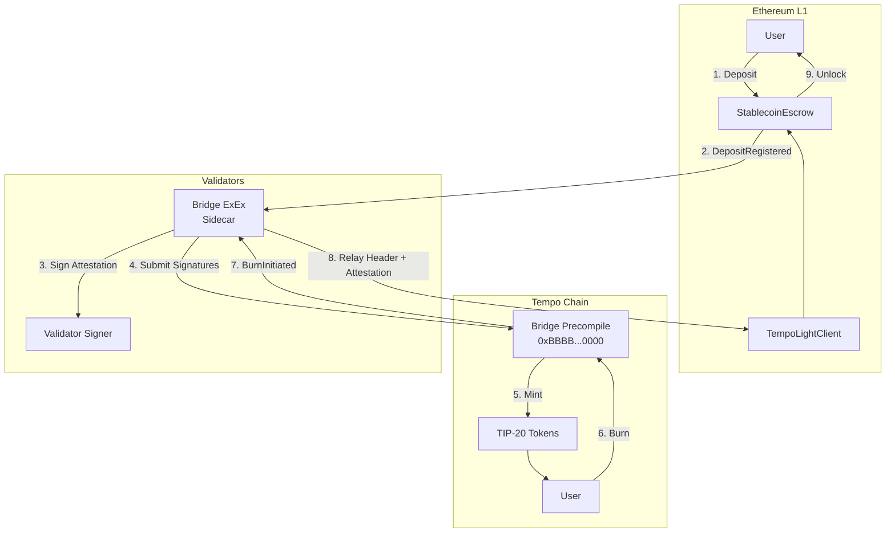
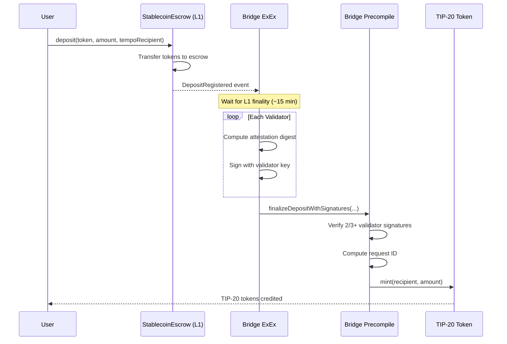
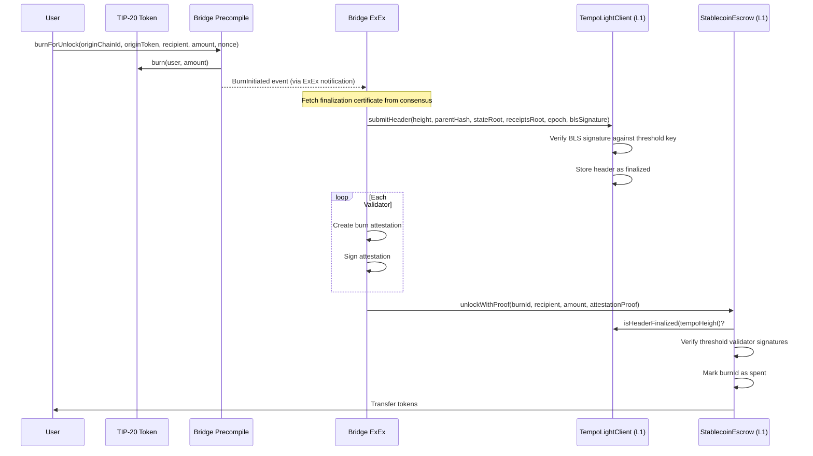

# Tempo Stablecoin Bridge Architecture

This document describes the architecture of the Tempo cross-chain stablecoin bridge, which enables secure token transfers between Ethereum L1 and Tempo.

## Overview

The Tempo bridge uses a **validator-attested model** where 2/3+ of active validators must sign attestations to process deposits and burns. This provides strong security guarantees while avoiding the complexity of on-chain state proof verification.



## Components

### 1. Bridge Precompile (`crates/precompiles/src/bridge/`)

**Address:** `0xBBBB000000000000000000000000000000000000`

The bridge precompile is a native Tempo contract that handles:

- **Token mapping registry**: Maps origin chain tokens to TIP-20 tokens on Tempo
- **Deposit processing**: Collects validator signatures and mints TIP-20 tokens
- **Burn initiation**: Burns TIP-20 tokens and emits events for origin chain unlocks

Key storage:
```
token_mappings: hash(chainId, originToken) → TokenMapping
deposits: requestId → DepositRequest
deposit_signatures: requestId → validator → bool
burns: burnId → BurnRequest
```

### 2. Origin Chain Contracts (`contracts/bridge/src/`)

#### TempoLightClient

Maintains finalized Tempo headers with validator signature verification:

- **BLS Mode (Production)**: Verifies aggregated BLS12-381 signatures from threshold validators
- **ECDSA Mode (Testing)**: Verifies threshold ECDSA signatures for testing environments

```solidity
// Key state
mapping(uint64 => bytes32) public headerHashes;
mapping(uint64 => bytes32) public receiptsRoots;
mapping(uint64 => uint256) public finalizedAt;
bytes public blsPublicKey;  // Aggregated validator key
```

#### StablecoinEscrow

Escrows tokens for bridging with validator-attested unlocks:

- **Deposit**: Locks tokens and emits `Deposited` event
- **Unlock**: Verifies burn attestations from threshold validators and releases tokens

```solidity
// Deposits are tracked by nonce per user
mapping(address => uint64) public depositNonces;

// Spent burn IDs prevent replay
mapping(bytes32 => bool) public spentBurnIds;
```

### 3. Bridge ExEx Sidecar (`crates/bridge-exex/`)

A reth Execution Extension that runs alongside each validator node:

| Module | Purpose |
|--------|---------|
| `exex.rs` | Main event loop processing ExEx notifications |
| `origin_watcher.rs` | Watches L1 for deposit events |
| `tempo_watcher.rs` | Watches Tempo for burn events via ExEx |
| `signer.rs` | Signs attestations (local key or AWS KMS) |
| `proof.rs` | Generates burn attestations |
| `consensus_client.rs` | Fetches finalization certificates for header relay |

---

## Deposit Flow (L1 → Tempo)



### Deposit ID Computation

Request IDs use domain separation to prevent replay attacks:

```
requestId = keccak256(
    "TEMPO_BRIDGE_DEPOSIT_V1" ||
    tempo_chain_id ||
    BRIDGE_ADDRESS ||
    origin_chain_id ||
    origin_token ||
    origin_tx_hash ||
    origin_log_index ||
    tempo_recipient ||
    amount ||
    origin_block_number
)
```

### Deposit Attestation Digest

Validators sign this digest to attest to deposits:

```
digest = keccak256(
    "TEMPO_BRIDGE_DEPOSIT_V2" ||
    tempo_chain_id ||
    bridge_address ||
    request_id ||
    origin_chain_id ||
    origin_escrow ||
    origin_token ||
    origin_tx_hash ||
    origin_log_index ||
    tempo_recipient ||
    amount ||
    origin_block_number ||
    validator_set_hash
)
```

---

## Burn/Unlock Flow (Tempo → L1)



### Burn ID Computation

Burn IDs include domain separation preventing cross-chain and cross-contract replay:

```
burnId = keccak256(
    "TEMPO_BRIDGE_BURN_V1" ||
    tempo_chain_id ||
    BRIDGE_ADDRESS ||
    origin_chain_id ||
    origin_token ||
    origin_recipient ||
    amount ||
    nonce ||
    sender
)
```

### Burn Attestation

Validators attest to burns by signing:

```
attestationDigest = keccak256(
    keccak256("TEMPO_BURN_ATTESTATION_V1") ||
    tempo_chain_id ||
    burn_id ||
    tempo_height ||
    origin_chain_id ||
    origin_token ||
    recipient ||
    amount
)
```

The attestation proof is ABI-encoded for on-chain verification:
```solidity
abi.encode(burnId, tempoHeight, originToken, recipient, amount, signatures[])
```

---

## Security Model

### Trust Assumptions

**Users must trust that >2/3 of validators are honest.**

| Threat | Impact |
|--------|--------|
| 2/3+ validators collude | Could attest to fake deposits, minting unbacked tokens |
| 2/3+ validators offline | Deposits/unlocks cannot be finalized |
| <1/3 malicious | No impact - cannot reach threshold |

### Attack Mitigations

| Attack Vector | Mitigation |
|---------------|------------|
| **Replay attacks** | Unique request/burn IDs with domain separation |
| **Cross-chain replay** | Chain ID binding in all signatures |
| **Front-running** | Recipient bound in signed message |
| **Double-spend** | `finalized`/`spent` flags checked before execution |
| **Signature reuse** | Domain prefixes: `TEMPO_BRIDGE_DEPOSIT_V2`, `TEMPO_BRIDGE_BURN_V1` |
| **Signature malleability** | Low-s enforcement (BIP-62) |
| **Reentrancy** | State updates before external calls |
| **Key rotation race** | Old validator set signs new pubkey, atomic switch |

### Recommended Defense-in-Depth (Future)

- Per-deposit caps (e.g., max $1M per deposit)
- Rate limits (e.g., max $10M per hour)
- Time-delayed finalization for large deposits
- Circuit breaker for anomaly detection

---

## Validator Signing Process

### Signer Types

The bridge supports multiple signer backends:

```rust
pub struct BridgeSigner {
    inner: Box<dyn AttestationSigner>,
}
```

| Signer | Use Case |
|--------|----------|
| `LocalSigner` | Development/testing with in-memory keys |
| `KmsSigner` | Production with AWS KMS HSM protection |

### Signing Flow

1. **ExEx detects event** (deposit on L1 or burn on Tempo)
2. **Compute attestation digest** with full domain separation
3. **Sign with validator key** (local or KMS)
4. **Submit signature** to bridge precompile (deposits) or escrow (unlocks)

### Low-S Signature Enforcement

All signatures enforce low-s values (BIP-62) to prevent malleability:

```rust
const SECP256K1_N_DIV_2: U256 = ...; // Half of curve order

// In verification:
if s > SECP256K1_N_DIV_2 {
    // Reject signature
}
```

---

## Light Client Verification

### Header Submission

The TempoLightClient on L1 tracks finalized Tempo headers:

```solidity
function submitHeader(
    uint64 height,
    bytes32 parentHash,
    bytes32 stateRoot,
    bytes32 receiptsRoot,
    uint64 epoch,
    bytes calldata signature  // BLS aggregated or ECDSA array
) external
```

**Verification:**
1. Height must be contiguous (`height == latestFinalizedHeight + 1`)
2. Parent hash must match stored header at `height - 1`
3. Signature must verify against threshold validator key

### BLS12-381 Signature Verification

In production mode, the light client uses BLS12-381 for efficient signature aggregation:

```solidity
// G1 point (signature): 128 bytes uncompressed / 48 bytes compressed
// G2 point (public key): 256 bytes uncompressed

function _verifyBLSSignature(bytes32 digest, bytes calldata signature) internal view {
    bool valid = BLS12381.verify(signature, blsPublicKey, digest);
    if (!valid) revert BLSVerificationFailed();
}
```

### ECDSA Mode (Testing)

For testing without BLS precompiles:

```solidity
function _verifyThresholdSignatures(bytes32 digest, bytes[] memory signatures) internal view {
    // Require 2/3 threshold
    // Signatures must be sorted by signer address (no duplicates)
    // Each signer must be in isValidator mapping
}
```

### Finality Semantics

Once a header is stored via `submitHeader()`:

- The header is **immutable** - no mechanism exists to overwrite it
- `finalizedAt[height]` records the Ethereum timestamp when finality was established
- The header mirrors Tempo's consensus finality - if validators signed, the block is final on Tempo

---

## Configuration

### ExEx Configuration

```toml
[bridge]
tempo_chain_id = 42161
test_mode = false  # Requires consensus_client in production
health_port = 8080

[bridge.chains.ethereum]
chain_id = 1
rpc_url = "https://eth-mainnet.g.alchemy.com/v2/..."
escrow_address = "0x..."
finality_blocks = 64  # Wait for L1 finality

[bridge.signer]
type = "kms"  # or "local" for testing
key_id = "arn:aws:kms:us-east-1:..."
address = "0x..."
```

### Token Mapping Registration

Bridge owner registers supported tokens:

```solidity
// On Bridge Precompile
bridge.registerTokenMapping(
    originChainId,  // e.g., 1 for Ethereum
    originToken,    // e.g., USDC address on Ethereum
    tempoTip20      // Corresponding TIP-20 address on Tempo
);

// On StablecoinEscrow
escrow.addToken(usdcAddress);
```

---

## Metrics & Monitoring

The bridge ExEx exposes Prometheus metrics:

| Metric | Description |
|--------|-------------|
| `bridge_deposits_processed` | Total deposits finalized |
| `bridge_burns_unlocked` | Total burns unlocked on origin |
| `bridge_proof_generation_seconds` | Attestation generation latency |
| `bridge_deposit_latency_seconds` | End-to-end deposit time |

Health endpoints for Kubernetes:
- `/health/live` - Liveness probe
- `/health/ready` - Readiness probe (checks RPC connectivity)

---

## Future Work

- [ ] Replace ECDSA with BLS12-381 on origin chains (requires EIP-2537 or ZK proof)
- [ ] Full MPT receipt proof verification (trustless fallback)
- [ ] Automated header relayer service
- [ ] Per-deposit caps and rate limiting
- [ ] Circuit breaker for anomaly detection
- [ ] Multi-chain support beyond Ethereum
